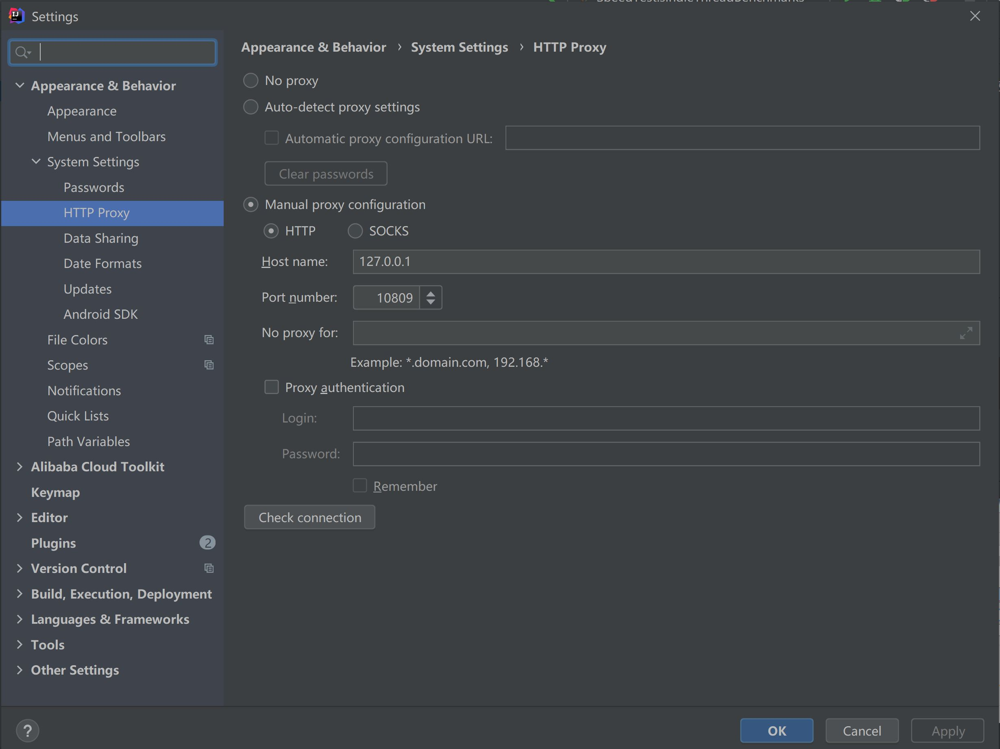
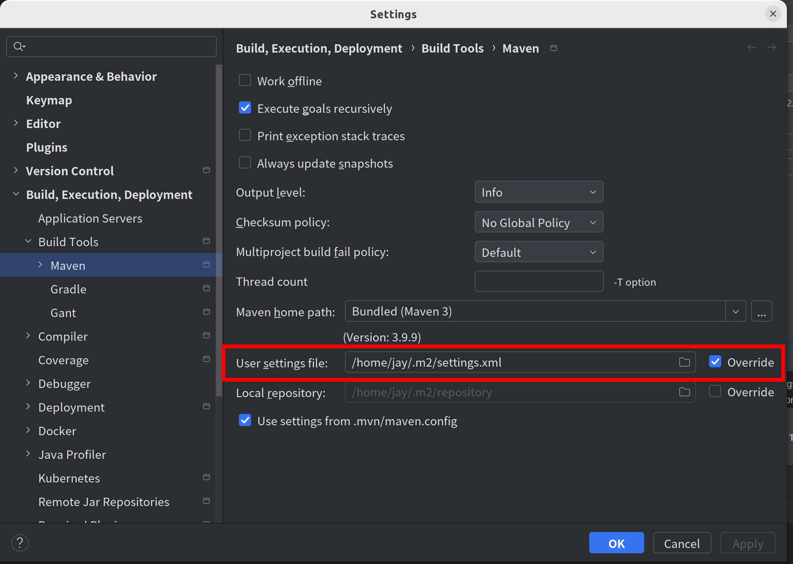
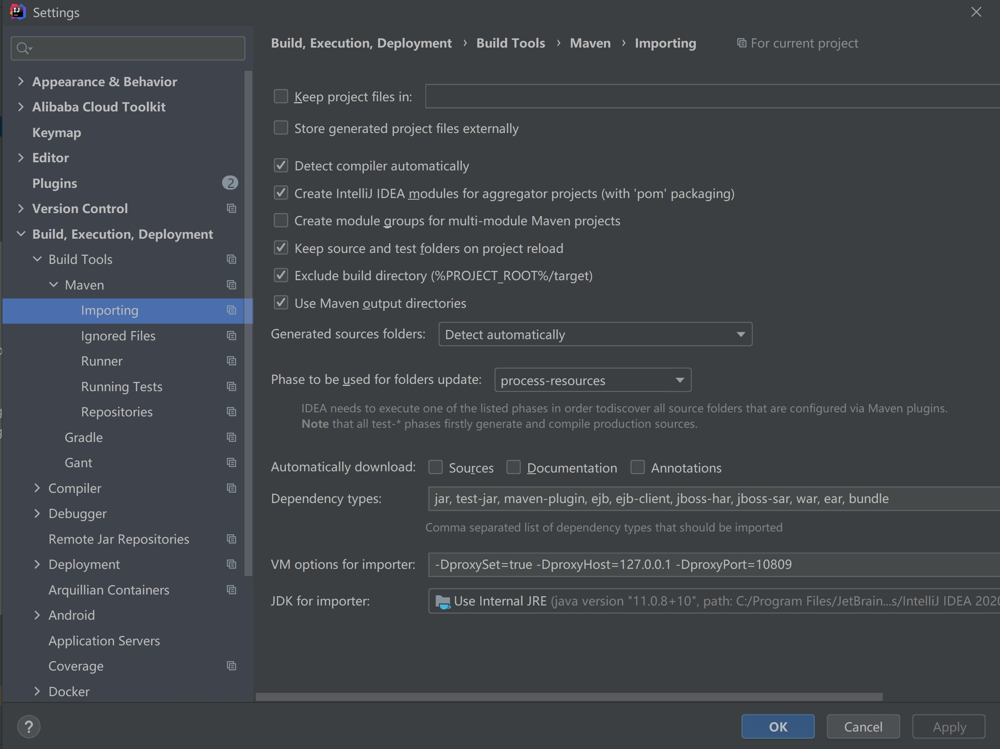

# Ⅰ. 环境搭建

## 1. Java安装，直接用Idea自带的（非全局）

```
安装JDK11
配置环境变量：JAVA_HOME      D:\Java\JDK    （JDK安装的目录，既bin层之上的目录）
              Path            %JAVA_HOME%\bin   （通过JAVA_HOME确定bin的目录）
在cmd命令中运行：java -version ,有结果返回则表示安装成功
```

## 2. git使用默认的安装，直接用Idea自带的（全局）

```
安装好以后，在git bash中输入：git --version，有结果返回则表示安装成功
```

- 参看所有的git配置，git config --list

- git下载代码慢的解决方法|无法下载代码的解决方法，取消git配置使用git config --global --unset http.proxy

```
使用vpn，老版本的是10809端口，新版本的只有一个10809端口
git config --global http.proxy http://127.0.0.1:10809
git config --global https.proxy https://127.0.0.1:10809
```

- 换行符

```
提交时转换为LF，检出时不转换，强烈推荐设置，可以减少不同电脑和不同系统之间切换，导致换行符不统一的问题
git config --global core.autocrlf input
```

- idea git log 不同颜色

```
黄色代表HEAD,
绿色表示的是你本地分支,
紫色是远程分支,
```

## 3. nodejs安装（非全局）

- windows直接默认安装，linux到官网 https://nodejs.org/ 查看最新的安装教程

```
查看npm是否安装成功：npm --version；  
查看nodejs是否安装成功：node --version；
```

- nodejs设置代理，大部分代理软件在windows的http代理端口是10809，ubuntu的是10808

```
npm config set proxy http://127.0.0.1:10809
```

- npm install -g yarn

- 在package.json文件右键,npm install安装依赖包

```
使用npm install安装需要的node module
安装完成后，在node module，和static上右键->mark Directory as->excluded
然后，File->Invalidate Cache/Restart

```

# Ⅱ. IntelliJ相关设置

## 1 参数配置：Help->edit custom

- 自定义idea参数，edit custom properties

````
# 控制台输出缓存，如果不使用下面的参数，也可以在Setting->Editor->General->Console中设置
# idea.cycle.buffer.size=disabled
# 设置可读文件大小
idea.max.intellisense.filesize=50000
````

- 自定义jvm参数，edit custom vm operation

```
-Xms1024m
-Xmx8192m
-XX:ReservedCodeCacheSize=512m


-Dfile.encoding=UTF-8
-Duser.name=jaysunxiao
```

## 2 界面设置和编码设置（需要上面两步做完）

- 文件编码设置：File->Settings->Editor->File Encodings

```
Global Encoding:UTF-8
Projectt Encoding:UTF-8
Default encoding for properties files:UTF-8
BOM for utf8: No Bom
```

## 3 换行符设置

- 统一用Unix换行符：File->Settings->Editor->Code Style

```
Line separator，Unix and MacOs （\n）
```

## 4 代码模板设置

- 设置类模板：Editor->File and Code Templates->Includes

```
/**
 * @author jaysunxiao
 */
```

- 版权信息设置：Editor->Copyright->Copyright Profiles，注意下面的版权信息不要有多余的换行

```
Copyright (C) 2020 The zfoo Authors
Licensed under the Apache License, Version 2.0 (the "License"); you may not use this file except
in compliance with the License. You may obtain a copy of the License at

http://www.apache.org/licenses/LICENSE-2.0

Unless required by applicable law or agreed to in writing, software distributed under the License is distributed
on an "AS IS" BASIS, WITHOUT WARRANTIES OR CONDITIONS OF ANY KIND, either express or implied.
See the License for the specific language governing permissions and limitations under the License.
```

# 5 代理设置

- idea代理设置
  

- maven需要设置代理，把当前目录中的settings.xml复制到.m2文件夹下，settings.xml中配置了proxy网络代理
  

- maven代理设置（非全局），-DproxySet=true -DproxyHost=127.0.0.1 -DproxyPort=10809
  

- 设置自动下载源代码，将上图的sources，documentation，annotations勾上

- mvn clean install -U ，强制检查maven库

## 6 使用Idea默认的快捷键设置

- eclipse快捷键设置，个人习惯

```
Run to Cursor，设置为F9
find，设置为ctrl+f
replace，设置为alt+f
close tab, 设置为 [ctrl + w]
folding，expand all设置为 ctrl +，collapse all设置为 ctrl -
在输入法上右键，将win10的简体繁体切换 [ctrl+f] 快捷键键取消，也取消 [ctrl + 空格] 的中英文切换快捷键
```

### 7 插件安装

- translate插件

```
快捷键设置
Show Translation Dialog，设置为ctrl + shift + x
Translate，设置为ctrl + x
```

- Maven Helper，maven依赖查看工具，推荐下载


# Ⅲ 其他软件安装

## 1. mongodb

1. 直接安装MongoDB，用custom自定义安装目录，一般用默认的安装目录即可，不要勾选mongoDB compas
2. 将C:\Program Files\MongoDB\Server\4.2\bin配置到环境变量中，便于全局使用
3. 直接安装MongoSh，将安装目录定位到MongoDB的bin目录
4. mongo -version # 查看安装的版本

## 2. 中间件安装

- zookeeper安装，解压过后，直接运行zkServer.md，zookeeper运行需要依赖JAVA_HOME环境变量
