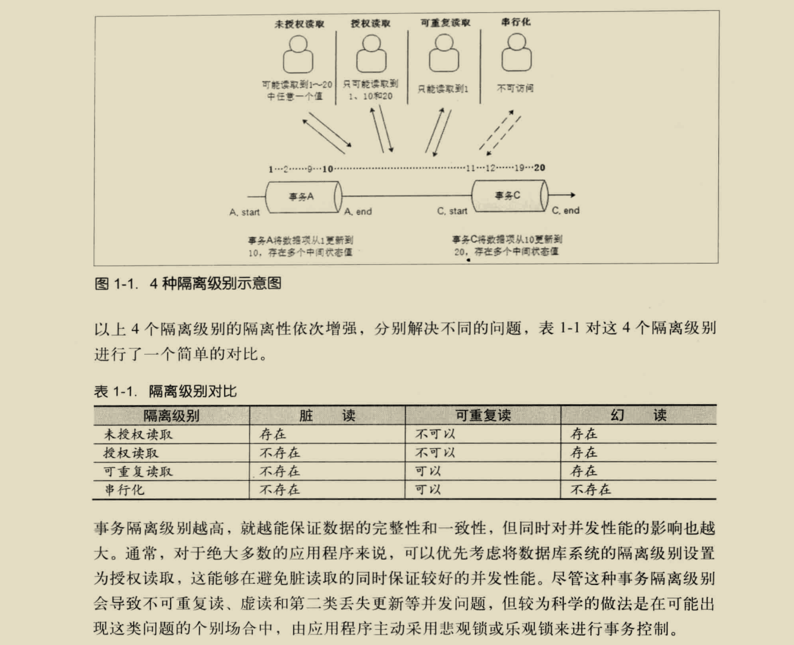
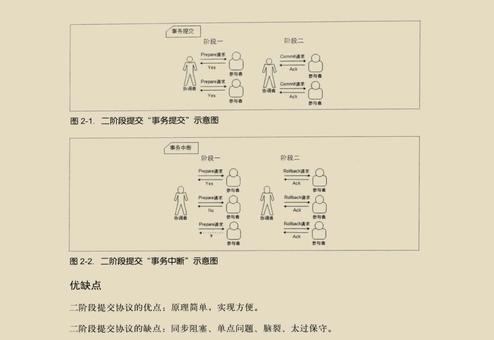
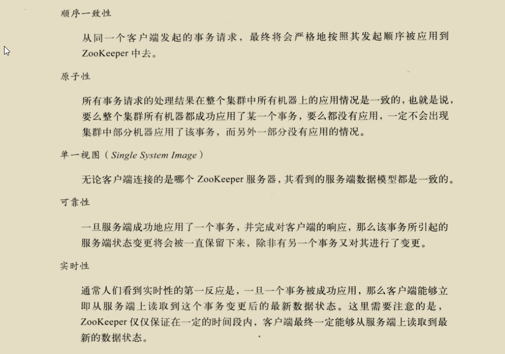

## 一.分布式系统

#### 分布式系统的定义：

- 分布式系统是一个硬件或软件组分布在不同的网络计算机上，彼此之间仅仅通过消息传递进行通信和协调的系统。

#### 分布式系统的特点：

1. 分布性  
   分布式系统中的多台计算机在空间上随意分布，不同城市，不同机房，不同机柜
2. 对等性  
   没有主/从之分，没有控制整个系统的主机，也没有被控制的从机，分布式系统所有的计算机节点都是对等的
3. 并发性    
   银行转账A转B问题

#### 分布式系统的各种问题：

1. 通信异常  
   单机内存访问的延时在纳秒量级（通常10ns），而一次网络通信的延迟在0.1-1ms左右，相当于内存访问延时的100多倍
2. 网络分区  
   网络由于发生异常，导致分布式系统中部分节点之间的网络延时不断增大，最终导致分布式系统中只有部分节点能保持正常通行，将这个现象称为网络分区。  
   这时会出现小集群，在极端情况下，这些小集群需要完成整个分布式系统所要完成的工作。
3. 三态  
   分布式系统中每一次的请求与相应，都存在三态，成功，失败，超时。 出现超时现象无法确定当前请求是否被成功处理
4. 节点故障  
   每个节点都有可能会出现故障，并且每天都在发生
5. 缺乏全局时钟   
   很难定义两个时间谁先谁后

## 二.分布式一致性算法

#### 事务（Transaction）

- ACID

1. 原子性（Atomicity）[ˌætəˈmɪsɪti] 要么做要么不做
2. 一致性（Consistency）事务的执行不能破坏数据库的完整性和一致性
3. 隔离性（Isolation）[ˌaɪsəˈleʃən] 在标准的SQL规范中有4个事务隔离级别  
   未授权读取，授权读取，可重复读取，串行化。
   
4. 持久性（Durability）[djʊərə'bɪlətɪ] 事务一旦提交，它对数据库的状态变更就应该是永久性的。

#### CAP定理（CAP theorem /ˈθɪərəm/）

- C：一致性(Consistency)，所有节点在同一时间具有相同的数据
- A：可用性(Availability)，保证每个请求在一定时间内，不管成功或者失败都有响应
- P：分区容错性(Partition tolerance)，系统中任意信息的丢失或失败不会影响系统的继续运作，一般指增加删除节点导致网络分区，不同分区依然可用

```
CA：  
    CA要求在多个节点满足数据的严格一致性，且延迟较低。
    如果要满足P，则可以容忍数据丢包，因为数据在跨节点传输时有可能会丢包，如果丢包就无法满足一致性。
    所以CA一般单点集群，传统的数据库系统就是具有CA特征的数据库，所以在可扩展性上不强，水平扩展能力比较差。

CP：  
    满足一致性，分区容忍性的系统，因为P会导致系统的节点无线延长，也就无法在一定时间内保证可用性。
    通常性能不是特别高。

AP：   
    满足可用性，分区容忍性的系统，就要放弃强一致性，保证最终一致性。因为为了保证可用性，有时候节点就会用自己的本地数据，导致数据不一致性。  
    
因为是分布式系统，所以应用必然需要部署到不同的节点中，因此必然出现子网络，所以P是分布式系统首先需要满足的。  
系统架构师往往把精力花在如何根据业务特点在C和A之间寻求平衡。  
```

#### BASE理论：

```
Basically Available（基本可用），运行损失部分可用性，如响应时间加长，或者功能上的损失，如双11服务降级   
Soft state（软状态），允许在不同节点的数据副本之间进行数据同步的过程中存在延时   
Eventually consistency（最终一致性），系统中的副本，在经过一段时间的同步后，最终能够达到一个一致的状态   
三个短语的简写即为BASE，BASE是对CAP中一致性和可用性权衡的结果，核心思想是即使无法做到强一致性（Strong consistency），但每个业务可以根据自身的业务特点，采用适当的方式来使系统达到最终一致性。
```

#### 分布式一致性协议：

当一个事务需要跨多个分布式节点的时候，为了保持事务处理的ACID特性，就需要引入一个称为“协调者”的组件来统一调度所有分布式节点的执行逻辑，来保证一致性。

2PC：Two Phase Commit，二段提交协议，大多数关系型数据库都是采用的这个协议来完成分布式事务的   


3PC：Three Phase Commit，三阶段提交协议

#### Paxos：分布式一致性算法

Proposer（提议者），Acceptor（决策者），Client（产生议题者），Learner（最终决策学习者）  
现在通过一则故事来学习paxos的算法的流程(2阶段提交)，有2个Client(老板，老板之间是竞争关系)和3个Acceptor(政府官员)：  
现在需要对一项议题来进行paxos过程，议题是“A项目我要中标！”，这里的“我”指每个带着他的秘书Proposer的Client老板。  
Proposer当然听老板的话了，赶紧带着议题和现金去找Acceptor政府官员。作为政府官员，当然想谁给的钱多就把项目给谁。  
Proposer-1小姐带着现金同时找到了Acceptor-1~Acceptor-3官员，1与2号官员分别收取了10比特币，找到第3号官员时，没想到遭到了3号官员的鄙视，3号官员告诉她，Proposer-2给了11比特币。  
不过没关系，Proposer-1已经得到了1,2两个官员的认可，形成了多数派(如果没有形成多数派，Proposer-1会去银行提款在来找官员们给每人20比特币，这个过程一直重复每次+10比特币，直到多数派的形成)，  
满意的找老板复命去了，但是此时Proposer-2保镖找到了1,2号官员，分别给了他们11比特币，1,2号官员的态度立刻转变，都说Proposer-2的老板懂事，这下子Proposer-2放心了，搞定了3个官员，  
找老板复命去了，当然这个过程是第一阶段提交，只是官员们初步接受贿赂而已。故事中的比特币是编号，议题是value。  
这个过程保证了在某一时刻，某一个proposer的议题会形成一个多数派进行初步支持。  
===============华丽的分割线，第一阶段结束================ 现在进入第二阶段提交，现在proposer-1小姐使用分身术(多线程并发)
分了3个自己分别去找3位官员，最先找到了1号官员签合同，遭到了1号官员的鄙视，  
1号官员告诉他proposer-2先生给了他11比特币，因为上一条规则的性质proposer-1小姐知道proposer-2第一阶段在她之后又形成了多数派(至少有2位官员的赃款被更新了);  
此时她赶紧去提款准备重新贿赂这3个官员(重新进入第一阶段)，每人20比特币。刚给1号官员20比特币， 1号官员很高兴初步接受了议题，还没来得及见到2,3号官员的时候，  
这时proposer-2先生也使用分身术分别找3位官员(注意这里是proposer-2的第二阶段)，被第1号官员拒绝了告诉他收到了20比特币，  
第2,3号官员顺利签了合同，这时2，3号官员记录client-2老板用了11比特币中标，因为形成了多数派，所以最终接受了Client2老板中标这个议题，对于proposer-2先生已经出色的完成了工作；

这时proposer-1小姐找到了2号官员，官员告诉她合同已经签了，将合同给她看，proposer-1小姐是一个没有什么职业操守的聪明人，觉得跟Client1老板混没什么前途，  
所以将自己的议题修改为“Client2老板中标”，并且给了2号官员20比特币，这样形成了一个多数派。顺利的再次进入第二阶段。由于此时没有人竞争了，顺利的找3位官员签合同，  
3位官员看到议题与上次一次的合同是一致的，所以最终接受了，形成了多数派，proposer-1小姐跳槽到Client2老板的公司去了。

#### ZAB：原子消息广播协议算法

ZAB：Zookeeper Atomic Broadcast，原子消息广播协议，Zookeeper分布式一致性的核心算法。包括两部分：崩溃恢复和消息广播（类似二阶段的提交过程）。  
具体一点可以分为三个阶段：发现（Leader选举），同步（Leader和Follower之间的同步），广播（接受客户端新的事务请求）。  
每个节点都可能处在三种状态，looking：leader选举阶段，following：follower服务器和leader保持同步状态，leading：Leader服务器作为主进程领导状态。

Paxos和ZAB的本质区别在于两者的设计目标不太一样。前者用于构建一个分布式的一致性状态机系统，而后者用于构建一个高可用的分布式数据主备系统。

## 三.Zookeeper基本说明

#### Zookeeper的定义：

- Zookeeper是一个高可用的分布式数据管理与协调框架

#### Zookeeper应用范围：

分布式应用可以基于Zookeeper实现如分布式一致性特性，数据发布/订阅，负载均衡，命名服务，分布式协调/通知,集群管理，Master选举，分布式锁，分布式队列

#### Zookeeper特点

- 高性能：Zookeeper将全量数据存储在内存中，并直接服务于客户端的所有非事务请求，因此它尤其适用于以读操作为主的应用场景。Zookeeper性能压测在100%读请求的场景下可以达到12-13W的QPS。
- 顺序访问：对于每一个客户端的请求，Zookeeper都会生成一个全局唯一的递增序号，这个序号反映了所有事务操作的先后顺序，应用程序可以使用这个特性来实现更高层次的同步原语。
- Leader服务器在产生一个新的事务的时候，会生成一个序列号ZXID，Zookeeper Transaction ID，这个ID有64位，前32位代表事务编号，每个事务加1，后32位代表发给客户端的计数器，每发给客户端计数器加1。  
  

#### Zookeeper的三种选举算法：LeaderElection，AuthFastLeaderElection，FastLeaderElection

默认的算法是FastLeaderElection：  
启动时的选举算法如下：

1. 目前有5台服务器，每台服务器均没有数据，它们的编号分别是1,2,3,4,5,按编号依次启动，它们的选择举过程如下：
2. 服务器1启动，给自己投票，然后发投票信息，由于其它机器还没有启动所以它收不到反馈信息，服务器1的状态一直属于Looking。
3. 服务器2启动，给自己投票，同时与之前启动的服务器1交换结果，由于服务器2的编号大所以服务器2胜出，但此时投票数没有大于半数，所以两个服务器的状态依然是LOOKING。
4. 服务器3启动，给自己投票，同时与之前启动的服务器1,2交换信息，由于服务器3的编号最大所以服务器3胜出，此时投票数正好大于半数，所以服务器3成为领导者，服务器1,2成为小弟。
5. 服务器4启动，给自己投票，同时与之前启动的服务器1,2,3交换信息，尽管服务器4的编号大，但之前服务器3已经胜出，所以服务器4只能成为小弟。
6. 服务器5启动，后面的逻辑同服务器4成为小弟。

崩溃恢复时的选举算法：


## 四.Zookeeper的应用

#### 数据发布/订阅

- 发布/订阅一般有两种设计模式，Zookeeper采用推拉结合的方式，一旦节点数据发生变化，服务端就会向客户端发送Watcher事件通知，客户端自己拉取想要的数据

```
服务器主动推（Push）：服务器主动将数据更新发送给所有订阅的客户端，这种数据量在短时间可能会很大
客户端主动拉（Pull）：客户端主动发起请求获取最新的数据，通常采用定时轮询的方式，这种缺点就是空轮询，客户端开销大
```

- 试用的场合

```
数据量比较小
数据内容在运行时会发生动态变化
集群中各机器共享，配置一致
```

#### 负载均衡

- 可分为硬件负载均衡和软件负载均衡

四层通过虚拟IP+端口接收请求，然后再分配到真实的服务器，如四层的负载均衡，就是通过发布三层的IP地址（VIP），然后加四层的端口号，来决定哪些流量需要做负载均衡，  
对需要处理的流量进行NAT处理，转发至后台服务器，并记录下这个TCP或者UDP的流量是由哪台服务器处理的，后续这个连接的所有流量都同样转发到同一台服务器处理。 以常见的TCP为例，负载均衡设备在接收到第一个来自客户端的SYN
请求时，即通过上述方式选择一个最佳的服务器，并对报文中目标IP地址进行修改(改为后端服务器IP），直接转发给该服务器。  
TCP的连接建立，即三次握手是客户端和服务器直接建立的，负载均衡设备只是起到一个类似路由器的转发动作。  
在某些部署情况下，为保证服务器回包可以正确返回给负载均衡设备，在转发报文的同时可能还会对报文原来的源地址进行修改。

七层通过虚拟的URL或主机名接收请求，然后再分配到真实的服务器，七层的负载均衡，就是在四层的基础上（没有四层是绝对不可能有七层的），再考虑应用层的特征。  
比如同一个Web服务器的负载均衡，除了根据VIP加80端口辨别是否需要处理的流量，还可根据七层的URL、浏览器类别、语言来决定是否要进行负载均衡。  
举个例子，如果你的Web服务器分成两组，一组是中文语言的，一组是英文语言的，那么七层负载均衡就可以当用户来访问你的域名时，自动辨别用户语言，然后选择对应的语言服务器组进行负载均衡处理。
以常见的TCP为例，负载均衡设备如果要根据真正的应用层内容再选择服务器，只能先代理最终的服务器和客户端建立连接(三次握手)后，才可能接受到客户端发送的真正应用层内容的报文，  
然后再根据该报文中的特定字段，再加上负载均衡设备设置的服务器选择方式，决定最终选择的内部服务器。负载均衡设备在这种情况下，更类似于一个代理服务器。  
负载均衡和前端的客户端以及后端的服务器会分别建立TCP连接。所以从这个技术原理上来看，七层负载均衡明显的对负载均衡设备的要求更高，处理七层的能力也必然会低于四层模式的部署方式。

负载均衡器通常称为四层交换机或七层交换机。四层交换机主要分析IP层及TCP/UDP层，实现四层流量负载均衡。七层交换机除了支持四层负载均衡以外，还有分析应用层的信息，如HTTP协议URI或Cookie信息。

    1、负载均衡分为L4 switch（四层交换），即在OSI第4层工作，就是TCP层啦。此种Load Balance不理解应用协议（如HTTP/FTP/MySQL等等）。例子：LVS，F5。
    2、另一种叫做L7 switch（七层交换），OSI的最高层，应用层。此时，该Load Balancer能理解应用协议。例子：  haproxy，MySQL Proxy。


#### 命名服务

- 集群中全局唯一ID的生成，用Java自带的UUID生成的是一长串没有意义的ID，在Zookeeper中创建一个顺序生成节点可以方便的生成全局唯一ID

#### 分布式协调/通知

- 在绝大多数的分布式系统中，系统机器间的通讯无外乎心跳检测，工作进度汇报和系统调度这三种类型

1. 心跳检测

```
传统的方案是一段时间A通ping到B，来判断A和B是否相连。
基于Zookeeper的心跳检测，A可以在Zookeeper注册一个临时节点，B监听这个节点的变化判断是否相连，这样可以极大的解耦合
```

2. 工作进度汇报

```
注册一个临时节点，节点的内容为自己的任务
```

3. 系统调度

```
通过临时节点的数据变化，控制其它监听该节点的系统
```

#### 集群管理

- 机器的上下线，机器监控

#### Master选举

- 集群中所有的节点同事注册一个/master的临时节点，哪个注册成功哪个就是master节点

#### 分布式锁

- 排它锁

```
获取锁：所有的客户端同事创建一个/lock临时节点，Zookeeper保证所有的客户端只有一个能创建成功，就认为这个客户端获取了锁，其它客户端注册监听，以便释放锁的时候重新获取锁
释放锁：获取锁的节点宕机，临时节点就会被移除；正常的执行业务逻辑后，主动释放锁，即删除这个临时节点
```

- 共享锁，又称为读锁

```
加上共享锁的对象，只能对锁中的内容进行读取操作，其它的事物也只能对该对象加共享锁
```

#### 分布式队列

- FIFO分布式队列
- Barrier分布式屏障


