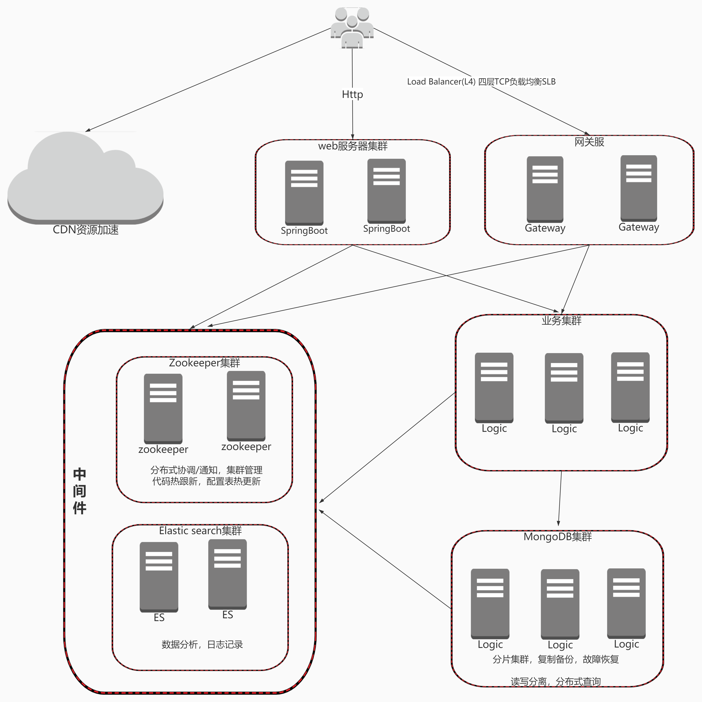

### Ⅰ. 简介

1. 优雅的同步和异步请求，速度更快
2. 服务注册和发现，配置中心使用的是zookeeper，可扩展成其它注册中心
3. 自带高性能网关，自定义转发策略
4. 服务可伸缩，负载均衡，集群监控，应有尽有。
4. 基于Java11，所有的依赖包都是最新的jar包

```关键词
变态的高性能，高可用性，高伸缩性（一般指增加机器），高扩展性（一般指代码层面的开闭原则）

config，本地配置，zookeeper的注册发现，请求的负载均衡，都放在这个包下
core，核心包，服务器，客户端的统一封装
dispatcher，消息的分发
handler，netty的handler，定义了客户端，服务器的一些通用handler
protocol，消息类的注册，消息的编解码，字节码增强等
schema，spring的自定义标签的解析
session，对netty的channel的封装
task，通用任务线程池
```

### Ⅱ. 服务器架构图

<br/>

### Ⅲ. 网络通信规范

- 客户端对服务器的请求以Request结尾，返回以Response结尾
- 服务器内部之间的调用以Ask结尾，返回以Answer结尾。

### Ⅳ. 教程

- [单机服务器教程](src/test/java/com/zfoo/net/core/tcp/server/TcpServerTest.java)
- [RPC教程](src/test/java/com/zfoo/net/core/provider/ProviderTest.java)
- [网关教程](src/test/java/com/zfoo/net/core/gateway/GatewayTest.java)

### Ⅴ. 依赖的中间件zookeeper教程

- [zk基础的增删改查](src/test/java/com/zfoo/net/zookeeper/base)
- [curator的增删改查](src/test/java/com/zfoo/net/zookeeper/curator)
- [zk分布式ID](src/test/java/com/zfoo/net/zookeeper/recipes/atomicint)
- [zk分布式Barrier](src/test/java/com/zfoo/net/zookeeper/recipes/distributedbarrier)
- [zk分布式锁](src/test/java/com/zfoo/net/zookeeper/recipes/distributedbarrier)
- [zk分布式选举](src/test/java/com/zfoo/net/zookeeper/recipes/mastersel)
- [zk数据发布/订阅](src/test/java/com/zfoo/net/zookeeper/recipes/nodecache)

