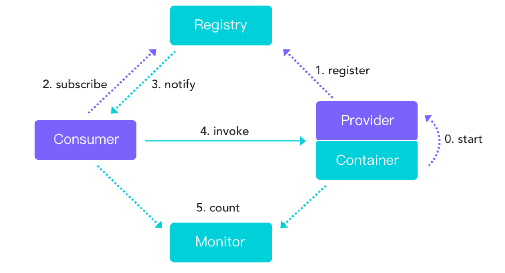
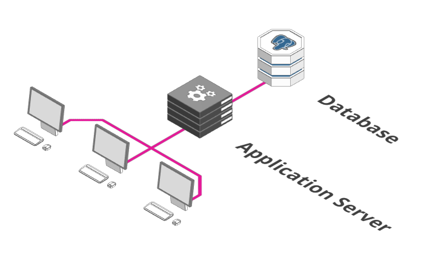
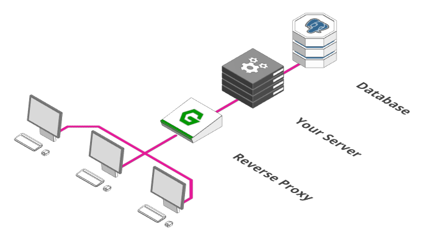
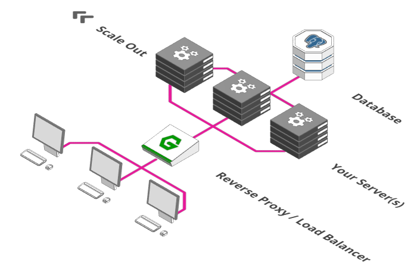
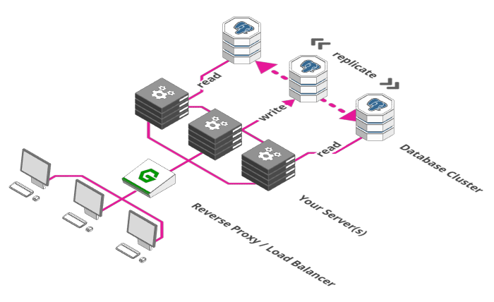
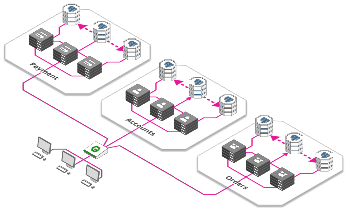
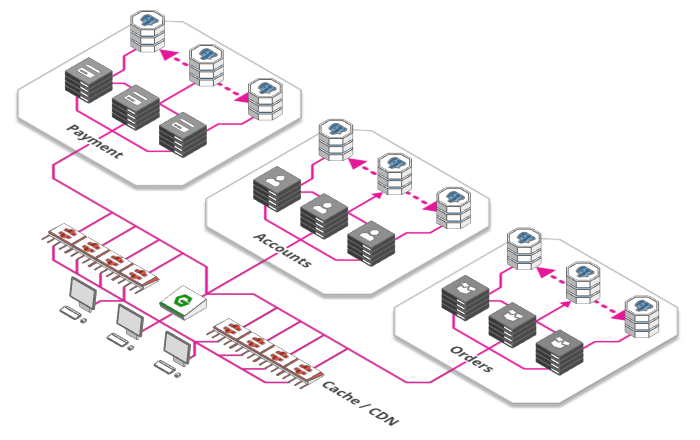
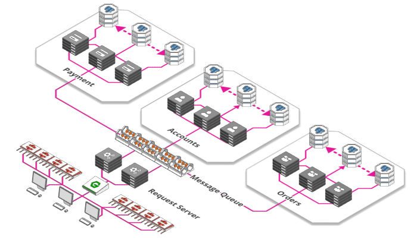
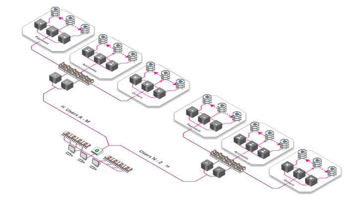
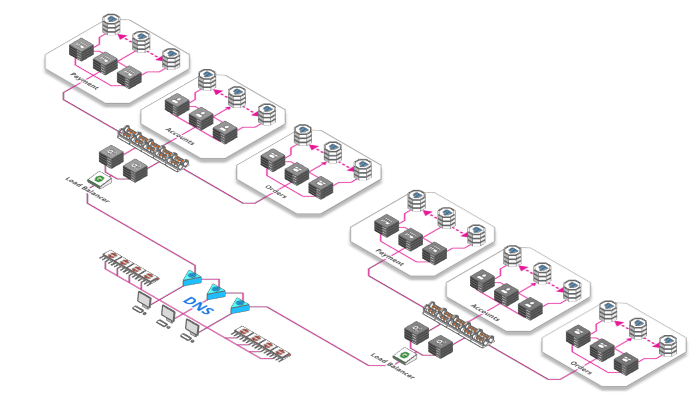

简体中文 | [English](./README.md)

### Ⅰ. 简介

- [net](https://github.com/zfoo-project/zfoo/blob/main/net/README.md) 天生异步，Actor设计思想，无锁化设计，基于Spring的MVC式用法的万能RPC框架

1. 优雅的同步和异步请求，速度更快，支持 tcp udp websocket
2. 服务注册和发现，配置中心使用的是zookeeper，可扩展成其它注册中心
3. 自带高性能网关，自定义转发策略
4. 服务可伸缩，负载均衡，集群监控，应有尽有
4. 基于Java17，所有的依赖包都是最新的jar包

### Ⅱ. 相关模块

- net提供了两层api接口
  - IRouter(low level api)为底层网络接口，直接通过Session连接发送消息
  - IConsumer(high level api)为高层网络接口，是对IRouter的封装，消费者向服务提供者发送RPC消息

```
极致的高性能，高可用性，高伸缩性（一般指增加机器），高扩展性（一般指代码层面的开闭原则）

config，本地配置，zookeeper的注册发现，请求的负载均衡，都放在这个包下
core，核心包，服务器，客户端的统一封装
router，消息的路由
handler，netty的handler，定义了客户端，服务器的一些通用handler
protocol，消息类的注册，消息的编解码，字节码增强等
schema，spring的自定义标签的解析
session，对netty的channel的封装
task，任务线程池，任务的分发
```

- 网络通信规范
  - 客户端对服务器的请求以Request结尾，返回以Response结尾
  - 服务器内部之间的调用以Ask结尾，返回以Answer结尾。

#### 诞生背景

```
用Java做网络游戏涉及到比较复杂的交互场景的时候，远程请求非常多，这时候就需要一个高性能的rpc框架。
Java生态的rpc框架非常多，但是很少有rpc框架能够契合到游戏项目的rpc框架，下面列了一些：
    dubbo，代码重量级，异步调用繁琐，没有网关，无法直接和客户端交互；
    grpc，代码重量级，使用复杂，部署复杂，没有网关，很难自定义；
    akka，用Scala语言，学习成本极高，直接放弃；
所以就写了一个万能的rpc框架，代码轻量级，可以方便的自定义，自带网关的，天生异步，工具链完整。
经过后续的不断优化，还做出了一个目前Java速度极快的序列化框架，然后速度就直接起飞了。
后来发现其实不仅仅能用来做游戏，只要有对性能有极致需求的rpc场景都能使用的上这个框架。
```

### Ⅱ. 服务器架构图



<br/>

### Ⅲ. 为什么快
----------

- 使用目前性能最好的 [zfoo protocol](protocol/README.md) 作为网关和RPC消息的序列化和反序列化协议
- 无锁化设计和优雅的线程池设计，用户的请求通过网关总能保证请求在同一台服务器的同一条线程去执行，所以就不需要用锁保证并发
- rpc调用天生异步支持，并且保证rpc异步调用结束过后在同一条线程去执行，类似于actor的设计思想，特别适合对性能有极高需求的场景
- 使用MVC设计模式，规范开发，保证代码质量，高效执行

### Ⅳ. 服务器架构演进

- 单台服务器+数据库，[zfoo net 单台服务器使用教程](src/test/java/com/zfoo/net/core/tcp/server/TcpServerTest.java)



----------

- 添加反向代理，类似网关

```
更大规模的架构做准备的第一步是添加一个“反向代理”
路由将请求转发到正确的端点
健康检查
身份验证确保实际允许用户访问服务器
防火墙确保用户只能访问我们允许他们使用的部分网络
```



----------

- 引入负载均衡器， [zfoo net 网关负载均衡教程](src/test/java/com/zfoo/net/core/gateway/GatewayTest.java)

```
负载均衡器的把请求分发到两台服务器上。用户 1 往左，用户 2 往右，用户 3 再往左。
```



----------

- 扩展数据库

```
集成的orm基于mongodb，可以支持分布式部署
mongodb，副本集部署（主从模式），可以数据同步，读写分离
mongodb，分片部署，故障转移（容灾）
```



----------

- 微服务，[微服务RPC教程](src/test/java/com/zfoo/net/core/provider/ProviderTest.java)

```
随着开发团队随着应用的发展而增长，越来越多的开发人员工作在同一台服务器上，发生冲突的可能性很大。
这个时候把通过微服务，把业务拆分出来是更好的选择。

微服务可以单独扩展，更好地适应需求。开发团队之间相互独立，每个团队都负责自己的微服务生命周期
每个微服务都有自己的资源，比如数据库
```



----------

- 缓存和内容分发网络(CDN)

```
网络应用的很大一部由静态资源构成，如图片、CSS 样式文件、Java 脚本以及一些针对特定产品提前渲染好的页面等等。
游戏应用也包含了大量的图片资源，3D建模的资源
缓存的加强版叫内容分发网络（Content Delivery Network），遍布全球的大量缓存。
这使得用户可以从物理上靠近他们的地方来获取网页内容，而不是每次都把数据从源头搬到用户那里。
```



----------

- 消息队列

```
流量消峰，有时需要处理大量比如双11抢购秒杀，让突然的大量请求排队去处理任务
应用解耦
消息分发
```



----------

- 分片，分区，比如将用户分配到与其最近的服务器提供服务

```
比如，两地三中心，容灾备份
```



----------

- 对负载均衡器进行负载均衡



### Ⅴ. 依赖的中间件zookeeper教程

- [zk基础的增删改查](src/test/java/com/zfoo/net/zookeeper/base)
- [curator的增删改查](src/test/java/com/zfoo/net/zookeeper/curator)
- [zookeeper实现的分布式自增ID](src/test/java/com/zfoo/net/zookeeper/recipes/atomicint)
- [分布式Barrier](src/test/java/com/zfoo/net/zookeeper/recipes/distributedbarrier)
- [分布式锁](src/test/java/com/zfoo/net/zookeeper/recipes/distributedbarrier)
- [数据发布和订阅](src/test/java/com/zfoo/net/zookeeper/recipes/nodecache)
- [zookeeper的分布式选举算法](src/test/java/com/zfoo/net/zookeeper/recipes/mastersel)

### Ⅵ. 参考文章

- [Scaling webapps for newbs](https://arcentry.com/blog/scaling-webapps-for-newbs-and-non-techies/)
