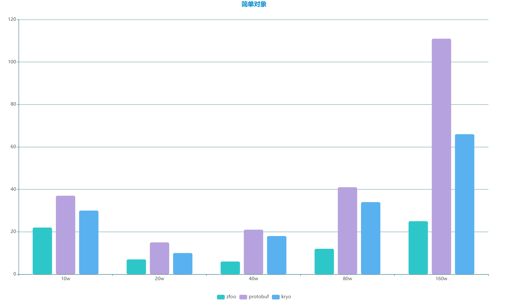

English | [简体中文](./README_CN.md)

### Ⅰ. Introduction

- [zfoo protocol](https://github.com/zfoo-project/zfoo/blob/main/protocol/README.md)
  Ultimate performance binary serialization and deserialization in Java, and has the fewest serialization bytes
- The protocol is currently natively supported **C++ Java Javascript C# Go Lua GDScript Python**，It's easy to do cross-platform
- The protocol can customize the private protocol format to make your protocol more secure, and supports adding fields
  and being compatible with previous and subsequent protocols
- Compatible with Protobuf, it supports the generation of Protobuf protocol files, and provides a generation method from
  POJO to PROTO
- There are already quite a few JetBrains plugins that can do it in the way to generate POJOs, and you can search for
  Proto in the plugin of Idea

### Ⅱ. Quick use

- Environment requirement **JDK 17+**, support **OpenJDK**, **Oracle JDK** and **native GraalVM**

- Protocol is an independent project, does not depend on other projects, can be directly opened, locally installed to
  its own local maven repository, can be used alone

```
// The zfoo protocol is registered and can only be initialized once
ProtocolManager.initProtocol(Set.of(ComplexObject.class, ObjectA.class, ObjectB.class));

// serialization
ProtocolManager.write(byteBuf, complexObject);

// deserialization
var packet = ProtocolManager.read(buffer);
```

### Ⅲ. Performance testing

- Single-threaded environment, 50% faster than Protobuf and 100% faster than Kryo without any JVM parameter
  tuning,[参见性能测试](src/test/java/com/zfoo/protocol/BenchmarkTesting.java)
- Thread safety, the performance of zfoo and Protobuf is not affected in any way, kryo will lose some performance
  because of thread insecurity,[参见性能测试](src/test/java/com/zfoo/protocol/BenchmarkTesting.java)


- Test the environment

```
system：win10
cpu： i9900k
内存：64g
```

- Single-threaded test with abscissa as the number of objects serialized and deserialized and time spent in milliseconds
  on the ordinate
  
  
  

### Ⅳ. Why fast

- Use Javassist bytecode to enhance the dynamic generation of serialization and deserialization functions for sequential
  execution, and sequential functions can be easily JIT compiled to achieve extreme performance
- Natively integrated with netty's high-performance Byte Buf
- With primitive type collection, there is no boxing and unboxing, invalid GCs are avoided, and the performance is fast
  enough
- Inherently thread-safe and lock-free; kryo forces each thread to have its own instance of Kryo, which is a heavy
  design, especially in scenarios with many threads
- No reflections, no unsafe operation; The use of objenesis in Kryo resulted in a lot of unsafe, and warnings when
  running in Java 11
- Flattening the call depth of the method stack, and there is no performance penalty for nesting data structures, such
  as List<Set<Map<>>>; Comparing kryo and protobuf data structure nesting results in a performance penalty
- There is no risk of vulnerability injection, only bytecode enhancement will be performed during initialization, and no
  bytecode operations will be performed in the later stage

```
The data compression volume is small, and the compression volume is smaller than that of Kryo and Protobuf; Smaller than kryo because kryo needs to write the registration number of each object
Intelligent syntax, incorrect protocol definitions will fail to start the program and give an error warning
Improve development efficiency, fully support POJO development, very easy to use
```

### Ⅴ. Why small

- Lightweight implementation, core serialization and deserialization code of about a thousand lines
- Optimized the zigzag and varint encoding algorithms for int and long, avoiding some redundant method calls and bit
  operations
- The data compression volume is small, and the compression volume is smaller than that of Kryo and Protobuf; Smaller
  than kryo because kryo needs to write the registration number of each object
- Intelligent syntax, incorrect protocol definitions will fail to start the program and give an error warning
- Improve development efficiency, fully support POJO development, very easy to use

```
The current size of the serialized object is as follows:
Simple objects, zfoo package size 8, kryo package size 5, protobuf package size 8
Regular objects, ZFOO package size 430, KRYO package size 483, Protobuf package size 793
For complex objects, ZFOO package size 2216, KRYO package size 2528, and Protobuf package size 5091
```

### Ⅵ. Data type

- Default data format support eliminates the need for users to register
  manually.[参考类定义](src/test/java/com/zfoo/protocol/packet/ComplexObject.java)
    - boolean，byte，short，int，long，float，double，char，String
    - Boolean，Byte，Short，Integer，Long，Float，Double，Character，If it is null during serialization, a default value of 0
      will be given (the default value of Character is Character.MIN VALUE)
    - int[]，Integer[]，If it is null, it is parsed as an array of length 0
        - Native generic List, Set, Map, deserialization return type Hash Set, Array List, Hash Map, and null pointer
          safe (returns a collection of size 0)
        - List<Integer>，You must specify a generic class if [1,1,null,1] is sent and [1,1,0,1] is received
        - List<XXXClass>，If [obj,obj,null,obj] is sent, [obj,obj,null,obj] is received, that is, the reference type is
          null before serialization, and it is also null after serialization

- Unsupported data formats, because ZFOO automatically recognizes unsupported types and gives error warnings, so users
  don't have to care too much
    - int[][]，Arrays above two dimensions, considering that not all languages support multidimensional arrays
    - List<Integer>[]，Map<Integer, Integer>[]，The Java language itself does not support generic class arrays
    - List<int[]>，Map<Integer, Integer[]>，Generics are set in arrays, which looks strange and has few actual uses
    - Enumerated classes, considering that many other languages do not support enumerated classes, can be replaced at
      the code level with int or string
    - Custom generic class XXX Class, <T>generic classes are prone to performance and parsing problems in many
      frameworks, and are not supported in all languages
    - Circular references, although the underlying support circular references, but considering that circular references
      bring semantically difficult to understand and prone to errors, so they are blocked

### Ⅶ. Protocol specifications

- The protocol class must be a simple javabean, not inheriting from any other class, but can inherit an interface

- The protocol number is defined as a short type to reduce the packet size and memory size, a packet can be reduced by 2
  bytes, and the application memory of each protocol can also be reduced by 6 byte(protocols + IProtocolRegistration +
  protocolIdMap)

```
It is difficult for a project's protocol body class to exceed 3 w, and there will be tools that automatically package 
your protocol number a little more compactly, so that your protocol number will not exceed 3 w
```

- There are three ways to indicate that the protocol class
    - The first uses annotations: @Protocol(id = protocolId)
      ```
      @Protocol(id = 104)
      public class SimpleObject {
      
          public int c;
          public boolean g;
      
      }
      ```


    - The second use: Register the agreement through Protocol Manager.initProtocolAuto() without writing the protocol
      number
      ```
      public class SimpleObject {
      
          public int c;
      
          public boolean g;
      
      }
      ```

- If you add a field for version compatibility, you need to add a Compatible annotation, and the order needs to be
  naturally increased, so as to ensure that the old and new protocols can be compatible with each other
- In order to be compatible with versions and avoid modifying field names, default uses field names to read and write
  in the natural order of strings (can also be customized), so it will cause exceptions in serialization
- The official environment does not necessarily have to delete an unwanted field in order to be version compatible and
  avoid reducing fields
- Among the six principles of design patterns, the principle of opening and closing is open to expansion and closed to
  modification. The design of the protocol should also adhere to this principle when it comes to functionality,
  prioritizing the addition of new protocols over modifying existing ones

### Ⅷ. Use Protobuf in zfoo

- zfoo only provides protobuf in the way of pojo like jprotobuf, but it can generate proto files for clients to use
  through pojo objects

- [jprotobuf](https://github.com/jhunters/jprotobuf) you can directly use simple pojo objects without having to
  understand proto file operations and syntax

- Generate a proto file for the client to use through the pojo
  object, [Generate a proto configuration](src/test/resources/protobuf.xml)

- You can also customize your own build method,
  [Use code custom generation to proto](https://github.com/zfoo-project/tank-game-server/tree/main/common/src/main/java/com/zfoo/tank/common/generate)


