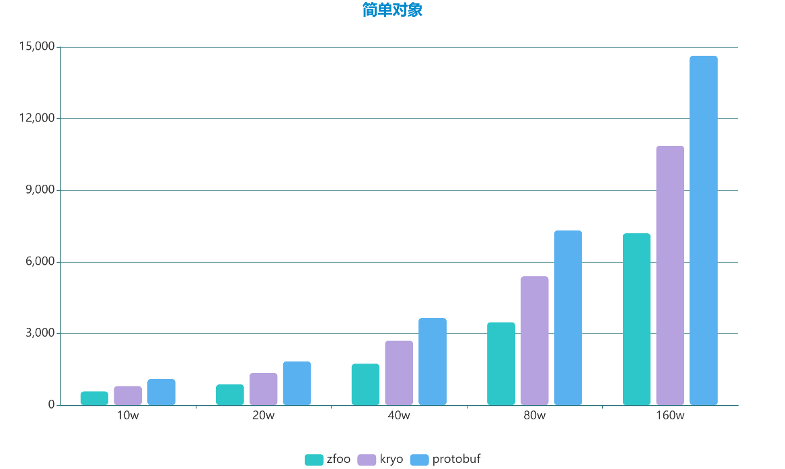
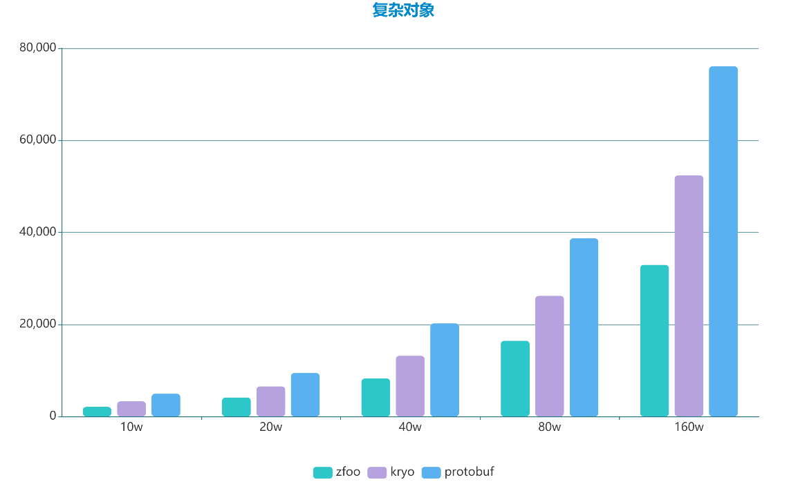

### Ⅰ. 简介

- zfoo protocol是目前的Java二进制序列化和反序列化最快的框架，并且线程安全
- 协议目前原生支持Java Javascript C# Lua，协议理论上可以跨平台
- 使用Javassist字节码增强动态生成顺序执行的序列化和反序列化函数，顺序执行的函数可以轻易的被JIT编译以达到极致的性能
- 单线程环境，在没有任何JVM参数调优的情况下速度比Kryo快40%，比Protobuf快110%，[参见性能测试](src/test/java/com/zfoo/protocol/SpeedTest.java)
- 多线程环境，zfoo和Protobuf的性能不受任何影响，kryo因为线程不安全性能会有所损失，[参见性能测试](src/test/java/com/zfoo/protocol/SpeedTest.java)

### Ⅱ. 快速使用

- 环境要求 **JDK 11+**，可以在 **OpenJDK** 和 **Oracle JDK** 无缝切换

```
// zfoo协议注册，只能初始化一次
ProtocolManager.initProtocol(Set.of(ComplexObject.class, ObjectA.class, ObjectB.class));

// 序列化
ProtocolManager.write(byteBuf, complexObject);

// 反序列化
var packet = ProtocolManager.read(buffer);
```

### Ⅲ. 性能测试

- 下面的是测试环境

```
操作系统：win10
cpu： i9900k
内存：64g
```

- 单线程测试，横坐标为序列化和反序列化的对象数量，纵坐标为花费的时间单位毫秒
  
  
  

### Ⅳ. 为什么快

- 轻量级实现，核心序列化和反序列化代码一千行左右
- 没有装箱和拆箱，避免了无效GC
- 天生线程安全并且无锁化；kryo强制要求每条线程都有自己的一个Kryo实例，这是一个比较重的设计，特别是线程比较多的场景
- 没有反射，没有unsafe操作；对比kryo中使用objenesis导致大量unsafe，而且在Java11中运行会出现警告
- 优化了int和long的zigzag和varint编码的算法，避免了一些多余的方法的调用和位操作
- 扁平化了方法栈的调用深度，数据结构嵌套没有任何性能损失，如List<Set<Map<>>>；对比kryo和protobuf数据结构嵌套会出现性能损失
- 顺序化序列化和反序列化函数，使用Javassist字节码增强动态生成顺序执行的序列化和反序列化函数可以轻易的被JIT编译以达到极致的性能
- 其它优点

```
无漏洞注入风险，只有初始化时会进行字节码增强，后期不会再进行任何字节码的操作
数据压缩体积小，压缩体积比kryo和protobuf都要小；比kryo小是因为kryo需要写入每个对象的注册号
跨平台可以轻易实现，目前已经原生支持Java，Javascript，C#，Lua，目前kryo无法跨平台，protobuf可以跨平台
智能语法分析，错误的协议定义将无法启动程序并给出错误警告
提升开发效率，完全支持POJO方式开发，使用非常简单
```

### Ⅴ. 待解决的问题

- 为了代码的优雅，zfoo protocol要求全部的协议类都要继承IPacket，但是可以保证不损失性能的情况下支持不继承IPacket的设计，这个有待继续讨论。
- 协议类修改

```
协议类属性名称修改名称过后无法解析，内部使用变量名称按照字符串的自然顺序来依次读写的，所以修改协议类属性的名称会导致自然顺序改变，进而导致读写顺序变化导致出现异常
协议类减少字段无法解析，字段不用了，就放在那不赋值就可以，没必要一定要删除，可以等到下个大版本更新再去删除，所以主要考虑增加字段的情况
协议类增加字段无法解析，这套框架是为通信设计的协议，增加字段服务器不更新也解析不出来新字段，既然服务器要更新为什么不直接通过版本号去控制？

目前的序列化过后对象的大小如下：
简单对象，zfoo包体大小8，kryo包体大小5，protobuf包体大小8
常规对象，zfoo包体大小547，kryo包体大小594，protobuf包体大小984
复杂对象，zfoo包体大小2214，kryo包体大小2525，protobuf包体大小5091

如果考虑支持修改协议类属性名称，要做的就是让协议类属性的读写顺序可控，就要引入很多的注解来标识属性的顺序（protostuff就是这样做的），但是感觉这样不优雅。
如果考虑支持字段增加和减少，需要消耗5%左右的性能（预估），并且增加一倍的包体积大小（写入字段的顺序），感觉不是非常划算。
因为可以通过协议版本号来解决这个问题，所以去支持这样的增删操作动力并不是非常的大。
```

### Ⅵ. 协议规范

- 协议类必须实现com.zfoo.protocol.model.packet.IPacket接口，协议类的的protocolId不能重复
- 协议类必须有一个标识为：public static final transient short PROTOCOL_ID的"协议序列号"，这个协议号的值必须和IPacket接口返回的值一样
- 协议类必须是简单的javabean，不能继承任何其它的类，但是可以继承接口

- 默认的数据格式支持，无需用户手动注册，[参考类定义](src/test/java/com/zfoo/protocol/packet/ComplexObject.java)
    - boolean，byte，short，int，long，float，double，char，String
    - Boolean，Byte，Short，Integer，Long，Float，Double，Character，序列化的时候如果null，会给个默认值0（Character默认值为Character.MIN_VALUE）
    - int[]，Integer[]，如果是null，则解析后的为new Integer[0]，一个长度为0的数组
        - 原生泛型List，Set，Map，反序列化返回类型为HashSet，ArrayList，HashMap，并且空指针安全（返回大小为0的集合）
        - List<Integer>，必须指定泛型类，如果发送的是[1,1,null,1]，接收到的是[1,1,0,1]
        - List<XXXClass>，如果发送的是[obj,obj,null,obj]，接收到的是[obj,obj,null,obj]，即引用类型序列化之前为null，序列化之后同样为null

- 不支持的数据格式，因为zfoo会自动识别不支持的类型并且给出错误警告，所以用户不必太关心
    - int[][]，二维以上数组，考虑到不是所有语言都支持多维数组
    - List<Integer>[]，Map<Integer, Integer>[]，Java语言本身就没有支持泛型类数组
    - List<int[]>，Map<Integer, Integer[]>，泛型里面套数组，这种写法看起来比较奇怪，实际使用的地方很少
    - 枚举类，考虑到很多其他语言不支持枚举类，可以用int或者string在代码层面做代替
    - 自定义泛型类XXXClass<T>，泛型类在很多框架中都极易出现性能上和解析上的问题，而且并不是所有语言都支持
    - 循环引用，虽然底层支持循环引用，但是考虑到循环引用带来语义上难以理解，容易出现错误，所以就屏蔽了
