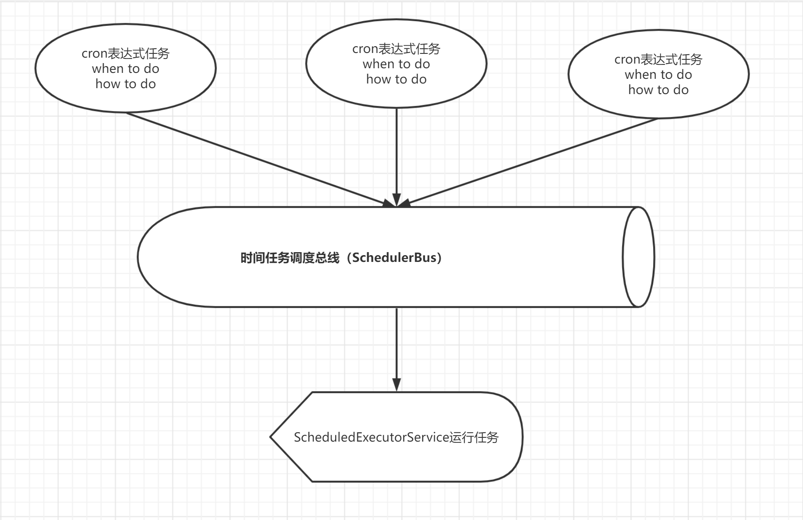

English | [简体中文](./README_CN.md)

### Ⅰ. Introduction

- [scheduler](https://github.com/zfoo-project/zfoo/blob/main/scheduler/README.md) The time task scheduling bus, cron
  expression parsing uses Spring's own interpreter pattern

### Ⅱ. Time task scheduling



- Adjusting the local machine time before and after triggers task scheduling, and local development is very useful
- ScheduledExecutorService.triggerPerSecond() executed every second，loop through the executable scheduler
- zfoo believes that a program does not have much time to schedule, so the Scheduled Executor Service has only one
  thread, so users should avoid doing time-consuming and blocking operations
- zfoo scheduler uses Javassist bytecode enhancement technology to dynamically proxy time scheduling tasks, avoiding
  reflections and no performance loss

### Ⅲ. Cron Expression Example

```
30 * * * * ?           Task is triggered every half minute
30 10 * * * ?          Trigger tasks every hour at 10 minutes and 30 seconds
30 10 1 * * ?          Task is triggered every day at 1:10:30 seconds
30 10 1 20 * ?         Task is triggered at 1:10:30 on the 20th of each month
30 10 1 20 10 ? *      Task is triggered every year on October 20 at 1:10:30 seconds
30 10 1 20 10 ? 2018   Task is triggered on October 20, 2018 at 1:10:30 a.m
30 10 1 ? 10 * 2018    Task is triggered every day on the 20th at 1:10:30 seconds In October 2018
30 10 1 ? 10 SUN 2018  Task is triggered every Sunday in October 2018 at 1:10:30 seconds 
15,30,45 * * * * ?     Task is triggered every 15, 30, 45 seconds per minute
15-45 * * * * ?        Task is triggered every second from 15 seconds to 45 seconds per minute
15/5 * * * * ?         Triggers start at 15 seconds per minute and trigger every 5 seconds
15-30/5 * * * * ?      Triggers start between 15 and 30 seconds per minute and trigger every 5 seconds
0 0/3 * * * ?          It starts at 0:0 every hour and triggers every three minutes
0 15 10 ? * MON-FRI    Triggered once a day from Monday to Friday at 10:15:00 seconds
0 15 10 L * ?          Task is triggered at 10:15:00 on the last day of each month
0 15 10 LW * ?         Task is triggered at 10:15:00 on the last working day of each month
0 15 10 ? * 5L         Task is triggered at 10:15:00 on the last Thursday of every month
0 15 10 ? * 5#3        Task is triggered on the Thursday of the third week of every month at 10:15:00
```
