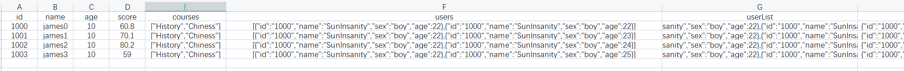

简体中文 | [English](./README.md)

### Ⅰ. 简介

- [storage](https://github.com/zfoo-project/zfoo/blob/main/storage/README.md)
  Java对象和excel/csv/json自动映射框架，只需要定义一个和Excel对应的类，直接解析Excel，json，csv

- 利用Java动态语言的反射特性，无需任何代码就能解析Excel

- 支持Excel导出json，csv文件

### Ⅱ. 自动映射

- Excel的第一行对应Java类属性，第二行和第三行不会起到注释的作用，其中第一列必须是Id属性



- Excel对应的Java类


- 除此之外你还可以使用Java新特性提供的record类


- 解析过后有两种使用方式
  1. 通过注解
  ```
   @Component
   public class StudentManager {

    @ResInjection
    private IStorage<Integer, StudentResource> studentStorage;

    }
  ```
  2. 通过类动态获取
  ```
  IStorage<Integer, StudentResource> studentStorage = StorageContext.getStorageManager().getStorage(StudentResource.class);
  ```

- 通过id找到对应的行

```
var studentResource = studentStorage.get(1000);
```

或者也可以通过如下方式获取
```
var resource = StorageContext.get(StudentResource.class, 1001);
```

- 通过索引找对应的行，默认为可重复的索引，返回了一个列表list

```
var students = studentStorage.getIndexes(StudentResource::getName, "james0");
```

如果你是record类则使用方式如下
```
var students = studentStorage.getIndexes(StudentResource::name, "james0");
```

- 唯一索引通过Storage.getUniqueIndex()获取，需要把索引注解标注为@Index(unique = true)

```
StudentResource student = storage.getUniqueIndex(StudentResource::idCard, "110101200007281903");
```

### Ⅲ. 热更新Excel/Json

- [tank](https://github.com/zfoo-project/tank-game-server/blob/main/common/src/main/java/com/zfoo/tank/common/util/HotUtils.java)
  分布式热更新Excel/Json/csv配置文件实现

### Ⅳ. 用途

- 财务分析，数据分析统计
- 游戏中的数值配置
